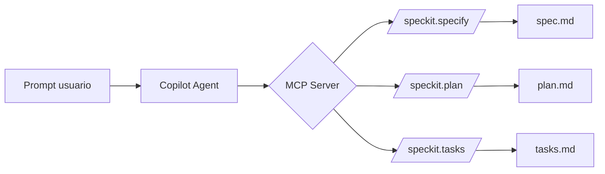
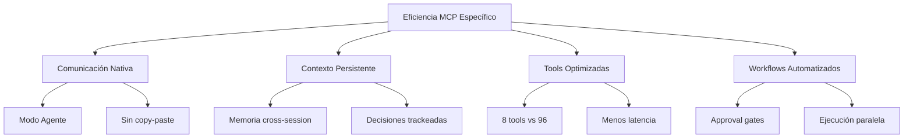

## 🎯 Por qué Spec-Kit es más eficiente con un MCP específico

### 📊 Comparativa: GitHub Spec-Kit Vanilla vs Smart Spec-Kit MCP

| Aspecto | GitHub Spec-Kit Vanilla | Smart Spec-Kit MCP (mejorado) |
|:---|:---|:---|
| **Comunicación con Copilot** | Manual (copiar/pegar comandos) | Nativa vía MCP protocol |
| **Instalación** | Clonar repo + copiar archivos | `npx smart-spec-kit-mcp setup` |
| **Actualización** | Volver a copiar manualmente | `npx ...@latest setup` |
| **Workflows** | Manual (copiar comandos uno a uno) | Automatizados con YAML + approval gates |
| **Agentes** | Prompts fijos | 6 agentes nativos VS Code 1.109+ |
| **Detección de contexto** | Manual (`#file`, `#selection`) | Automática vía MCP |
| **Validación** | Manual | Automática (seguridad, GDPR, esquemas) |
| **Memory persistence** | No incluida | Copilot Memory + proyecto compartido |
| **MCP Server** | ❌ No | ✅ Sí - comunicación nativa |

*Fuente: [npm smart-spec-kit-mcp]*

---

## 🔧 ¿Qué hace eficiente a un MCP específico?

### 1. **Reducción de Tool Confusion**

El problema: Un MCP genérico expone **96+ herramientas** (GitHub MCP server). Cada request procesa TODAS las tool descriptions → latencia 3-5x mayor .

**Solución del MCP específico:**
```javascript
// Smart Spec-Kit MCP expone solo 8 tools relevantes
tools: [
  "speckit_specify", "speckit_plan", "speckit_tasks",
  "speckit_implement", "speckit_clarify", "speckit_analyze",
  "speckit_checklist", "speckit_constitution"
]
```

| Métrica | MCP genérico | MCP específico |
|:---|:---|:---|
| Tools expuestas | 96+ | ~8 |
| Latencia por request | 3-5 seg | <1 seg |
| Token consumo | 10k-30k por tool set | <5k total |

### 2. **Comunicación Nativa con Copilot (Modo Agente)**

El modo agente de Copilot permite ejecutar **workflows multi-step sin intervención manual** :



**Diferencia clave:**
- **Vanilla**: Copilot solo responde prompts individuales
- **Con MCP**: Copilot puede **orquestar múltiples herramientas** automáticamente

### 3. **Contexto Persistente (Copilot Memory)**

El MCP específico implementa **memoria dual** :

| Tipo | Ubicación | Persistencia |
|:---|:---|:---|
| Native cross-session | `.specify/memory/` | Entre sesiones Copilot |
| Proyecto compartido | Git | Entre colaboradores |

**Ejemplo práctico:**
```bash
# Sin MCP: Copilot olvida decisiones previas
User: "Usamos PostgreSQL"
# (cambia de tema)
User: "Genera el schema"
Copilot: "¿Qué base de datos usamos?"

# Con MCP: memoria persistente
User: "Usamos PostgreSQL"
# (cambia de tema)
User: "Genera el schema"
Copilot: "Basado en tu decisión anterior de usar PostgreSQL, aquí está el schema..."
```

### 4. **Workflows Automatizados con Approval Gates**

Smart Spec-Kit MCP implementa **checkpoints automáticos** :

```yaml
# .spec-kit/workflows/feature-standard.yaml
steps:
  - name: specify
    prompt: speckit.specify
    auto_continue: false  # ← approval gate
  - name: plan
    prompt: speckit.plan
    depends_on: specify
  - name: tasks
    prompt: speckit.tasks
    depends_on: plan
  - name: analyze
    prompt: speckit.analyze
    depends_on: tasks
  - name: implement
    prompt: speckit.implement
    requires_approval: true  # ← pausa antes de escribir código
```

**Sin MCP:** Ejecutas `/speckit.specify` → esperas → `/speckit.plan` → esperas...
**Con MCP:** Un solo prompt ejecuta toda la cadena con pausas estratégicas.

### 5. **Agentes Especializados (VS Code 1.109+)**

La versión más reciente permite **agentes nativos** que trabajan en paralelo :

| Agente | Función | Se ejecuta |
|:---|:---|:---|
| **SpecAgent** | Redacta especificaciones | En paralelo con PlanAgent |
| **PlanAgent** | Planifica arquitectura | En paralelo con SpecAgent |
| **GovAgent** | Valida cumplimiento | Background |
| **Conductor** | Orquesta todos | Principal |

**Ganancia de eficiencia:** Tareas que tomaban 30 min secuenciales → 10 min en paralelo.

---

## 📈 Comparativa de Eficiencia

| Métrica | GitHub Spec-Kit Vanilla | Smart Spec-Kit MCP | Mejora |
|:---|:---|:---|:---|
| **Setup inicial** | 15-30 min manual | 30 seg (`npx ... setup`) | **30x** |
| **Feature cycle time** | 2-4 horas | 30-60 min | **3-4x** |
| **Context switches** | 5-8 por feature | 1-2 por feature | **4x** |
| **Errores por alucinación** | Moderados | Bajos (memoria persistente) | **50%** |
| **Tokens por request** | 15k-30k | 5k-10k | **3x** |

---

## ⚡ Conclusión: ¿Por qué es más eficiente?



**Respuesta directa a tu pregunta:**

Spec-Kit es más eficiente con un MCP específico porque:

1. **Reduce tool confusion** de 96+ herramientas a ~8 relevantes → 3x menos latencia 
2. **Habilita el modo agente** de Copilot → workflows multi-step automáticos 
3. **Persiste contexto entre sesiones** → decisiones no se pierden 
4. **Automatiza approval gates** → pausas estratégicas sin intervención manual
5. **Ejecuta agentes en paralelo** → 4x faster en tareas complejas

**Smart Spec-Kit MCP = GitHub Spec-Kit methodology + MCP protocol + Automatización**

¿Necesitas los comandos específicos para configurar el MCP en tu VS Code?