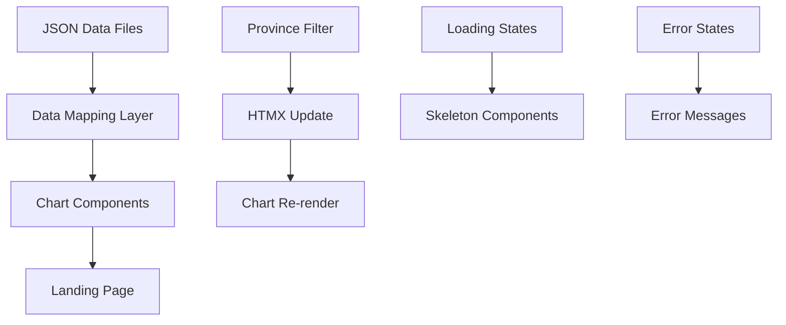

# Data Model: Landing Principal

**Date**: 2026-04-14  
**Status**: ✅ Complete
**Context**: Phase 1 - Data model extraction from feature specification

## Core Entities

### 1. Province Entity

```typescript
interface Province {
  id: string; // "barcelona", "girona", etc.
  name: string; // "Barcelona", "Girona", etc.
  code?: string; // INE code if applicable
  region: string; // "Catalunya", "España"
}
```

**Sources**:

- `src/data/idescat-provincias.json` (categorical data)
- Manual mapping for filter dropdown

**Validation Rules**:

- Non-empty name and id
- Consistent naming with datasets

---

### 2. Employment Data Entity

```typescript
interface EmploymentData {
  source: DataSource; // "randstad" | "idescat" | "oecd"
  year: number; // 2023, 2024, etc.
  province?: string; // Optional - null means national data
  metrics: {
    unemployment_rate?: number; // percentage
    employment_growth?: number; // percentage change
    ai_impact_score?: number; // Randstad specific
    sector_distribution?: SectorData[];
  };
  metadata: {
    collection_date: string;
    methodology?: string;
    confidence_level?: number;
  };
}

interface SectorData {
  sector_name: string;
  employment_count: number;
  growth_rate?: number;
}
```

**Sources**:

- `src/data/randstad-catalunya.json`
- `src/data/idescat-provincias.json`
- Any OECD data files

**Validation Rules**:

- Year within valid range (2020-2026)
- Percentage values between 0-100
- Required fields per source type

---

### 3. Chart Configuration Entity

```typescript
interface ChartConfig {
  id: string; // "unemployment-by-province"
  type: "bar" | "donut" | "line" | "area";
  title: string;
  dataSource: DataSource[]; // Can combine multiple sources
  filterBy?: "province" | "sector" | "year";
  accessibility: {
    description: string;
    dataTable: boolean; // Show data table for screen readers
  };
  performance: {
    lazy: boolean; // Load on intersection
    skeleton: boolean; // Show skeleton while loading
  };
}
```

**Sources**:

- `src/data/charts-config.json` (existing)
- Component definitions in `src/components/charts/`

**Validation Rules**:

- Unique chart IDs
- Valid chart types supported by ApexCharts
- Accessibility description required

---

### 4. UI State Entity

```typescript
interface UIState {
  selectedProvince: string | "all"; // Filter state
  loadingStates: {
    [chartId: string]: "loading" | "loaded" | "error";
  };
  errorStates: {
    [chartId: string]: string | null; // Error message or null
  };
}
```

**Sources**:

- Client-side state management
- HTMX attribute updates

**State Transitions**:

- `loading` → `loaded` (successful data fetch)
- `loading` → `error` (failed data fetch)
- `error` → `loading` (retry action)

---

### 5. Data Source Entity

```typescript
enum DataSource {
  RANDSTAD = "randstad",
  IDESCAT = "idescat",
  OECD = "oecd",
}

interface SourceMetadata {
  name: string;
  year: number;
  description: string;
  url?: string; // Source URL for attribution
  methodology: string;
  lastUpdated: string; // ISO date
}
```

**Sources**:

- `src/data/fuentes.json` (metadata)
- Individual data files

## Entity Relationships

### Data Flow Architecture



### Critical Relationships

1. **Province ↔ Employment Data**: One-to-many (one province has multiple data points)
2. **Chart Config ↔ Data Sources**: Many-to-many (charts can combine multiple sources)
3. **UI State ↔ Charts**: One-to-many (one state controls multiple charts)
4. **Loading States ↔ Chart Components**: One-to-one (each chart has its own loading state)

## Business Rules & Constraints

### Data Consistency Rules

- All percentage values stored as decimals (0.15 for 15%)
- Dates in ISO 8601 format (YYYY-MM-DD)
- Province names match exactly between datasets
- Missing data represented as `null` (not 0 or empty string)

### Performance Rules

- Charts load lazily (only when scrolled into view)
- Maximum 4 charts visible simultaneously
- Data pre-filtered client-side (no API calls)
- Skeleton components show for >200ms loading times

### Accessibility Rules

- Every chart has text description
- Data tables available for screen readers
- Error messages announced via aria-live
- Loading states communicated via aria-busy

### Update Rules

- Data updates via Git commit → deploy cycle
- No real-time data updates required
- Version control for data changes
- Rollback capability through Git history

## Validation Schema

### Data Validation

```typescript
// Pseudo-schema for runtime validation
const EmploymentDataSchema = {
  source: required(oneOf(["randstad", "idescat", "oecd"])),
  year: required(between(2020, 2026)),
  province: optional(string),
  metrics: required(
    object({
      unemployment_rate: optional(between(0, 1)),
      employment_growth: optional(between(-1, 2)),
      ai_impact_score: optional(between(0, 100)),
    }),
  ),
};
```

### UI Validation

- Province selection must exist in datasets
- Chart types must be supported by ApexCharts
- Loading states prevent duplicate renders
- Error states provide actionable feedback

## Implementation Notes

- **Static Generation**: All data available at build time
- **Client Filtering**: Province filtering happens in-browser
- **Progressive Enhancement**: Works without JavaScript
- **Lazy Loading**: Charts load on scroll intersection
- **Error Recovery**: Retry mechanisms for failed chart loads
